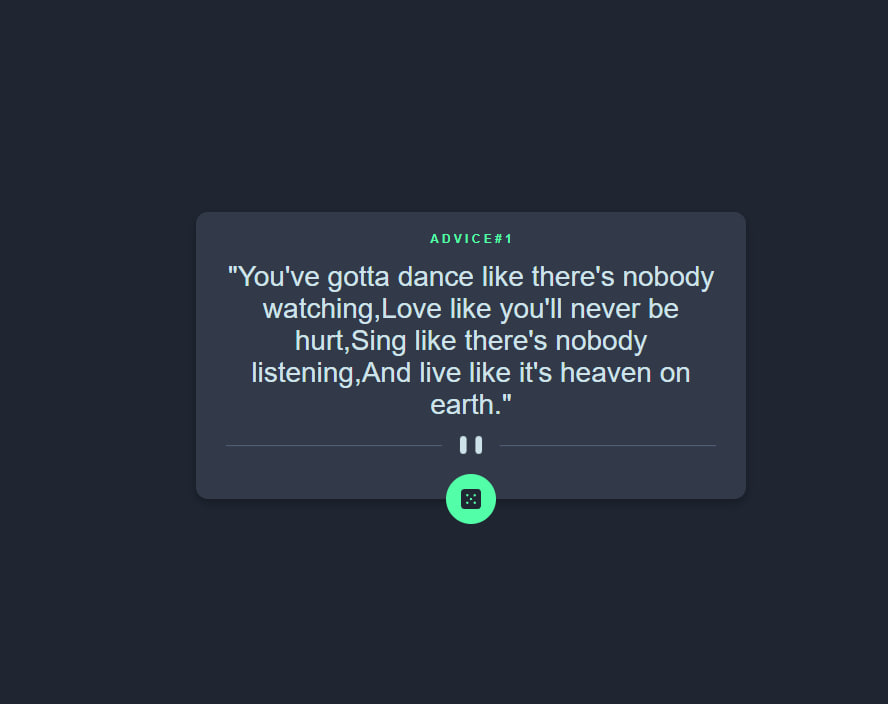

# 🎲 FM Advice Generator App

  
*A simple advice generator app built with Next.js and the Advice API.*

This project is a small interactive web application that generates random pieces of advice fetched from an external API. It adapts to different screen sizes and includes smooth hover effects for interactive elements.

---

## 🛠️ Technologies

| Technology | Purpose |
|-----------|---------|
|  | React framework for SSR and SPA |
|  | Core scripting language |
|  | CSS preprocessor for styling |
|  | CSS-in-JS styling |
|  | Source of random advice data |

---

## ⚡ Features

- Responsive layout adapting to all screen sizes.  
- Hover states for interactive elements.  
- Fetches and displays a new piece of advice with each click on the dice icon.  

---

## 🚀 Local Setup

```bash
# Clone the repository
git clone https://github.com/oyakovytskyi/advice-generator-app.git
cd advice-generator-app

# Open
index.html
```
